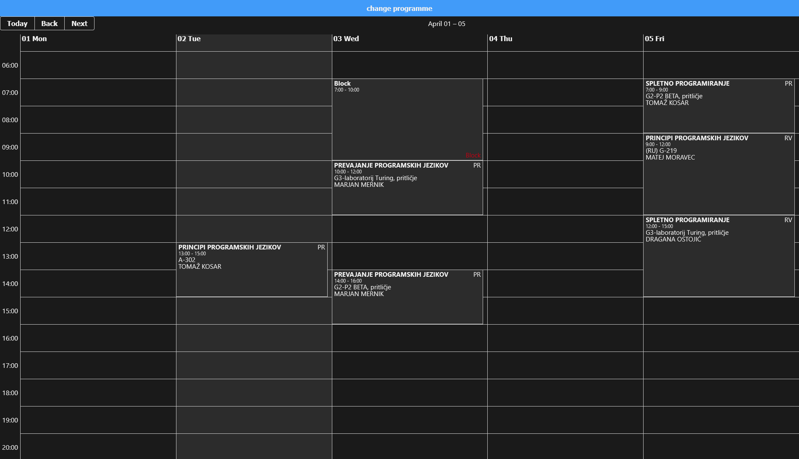
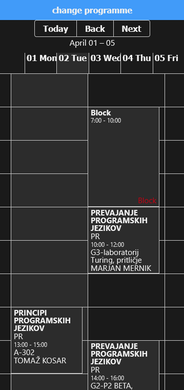
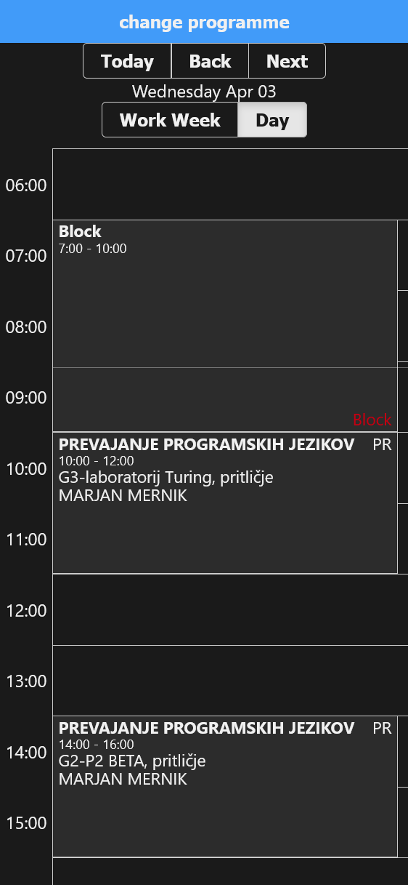

  

# Open Wise TimeTable Web

[](https://www.gnu.org/licenses/gpl-3.0)  


This is a website made with react, to view wise timetable.  
| Desktop                                    | Mobile                                    | Mobile day view                            |
| ------------------------------------------ | ----------------------------------------- | ------------------------------------------ |
|  |  |  |

## Features:
- Dark/light theme
- Automatically remembers selected groups
- Desktop and mobile support
- Can be installed as a progressive web app

## Setup instructions

1. Clone the repo
2. run  ``` yarn install ```
3. Rename loginCredentials to loginCredentials.js in constants folder and enter your credentials
4. ``` npm start ```

To deploy to github pages, run ``` npm run deploy ```  
Note: Due to CORS headers, a proxy is needed to remove them.
