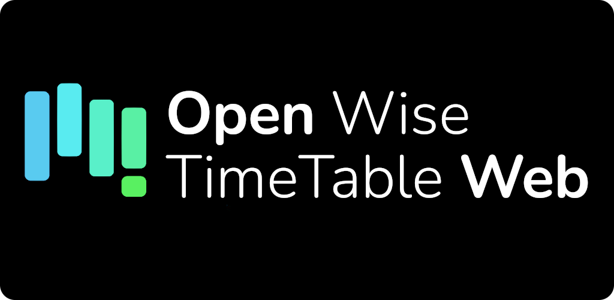
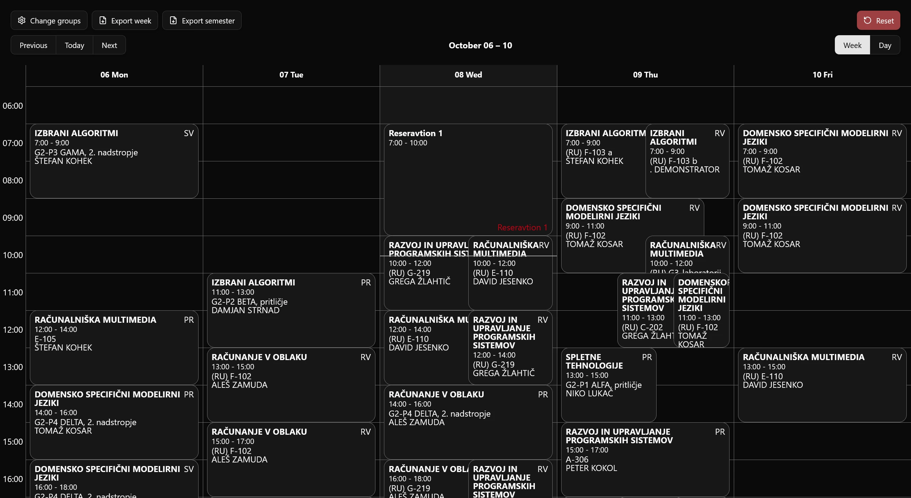
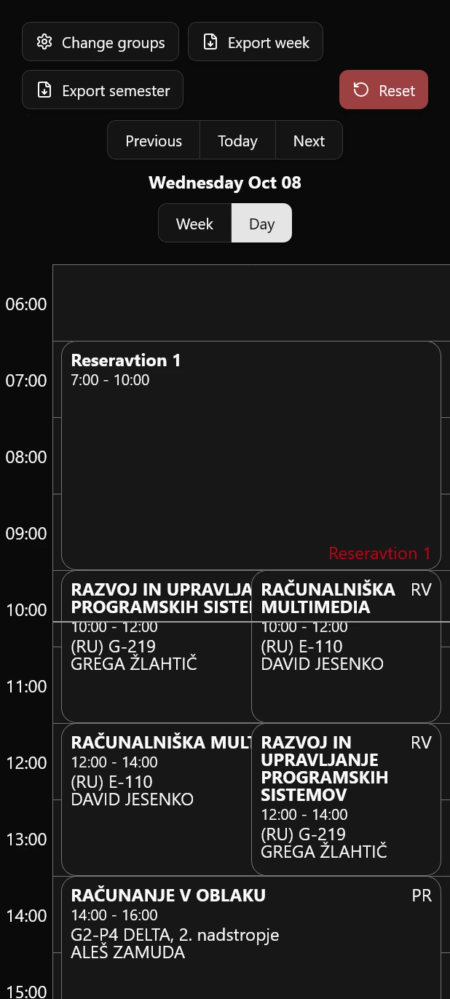
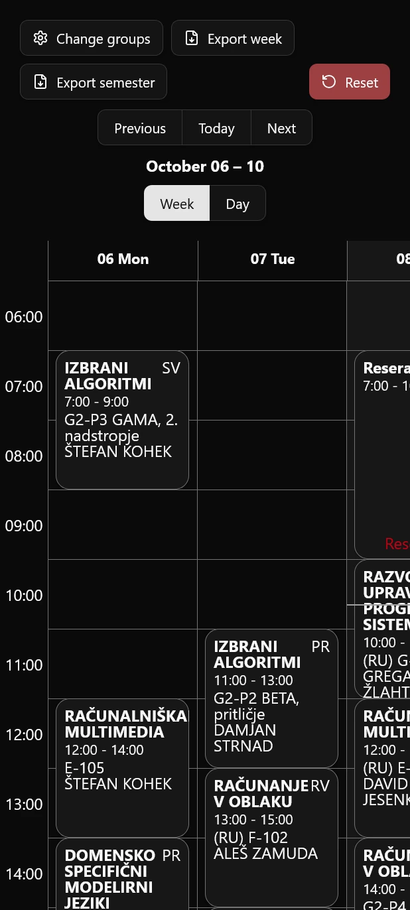

  

# Open Wise TimeTable Web


This is a website to view wise timetable lectures.  
| Desktop                                    | Mobile                                    | Mobile day view                            |
| ------------------------------------------ | ----------------------------------------- | ------------------------------------------ |
|  |  |  |

## Features:
- Dark/light theme
- Select different groups for each course
- Export timetable to ics format
- Automatically remembers selected groups
- Desktop and mobile support
- Can be installed as a progressive web app

## Setup instructions

1. Clone the repo
2. Run  ``` npm install ```
3. Copy and rename ``` example.env ``` to ``` .env ```
4. Run ``` npm run dev ```

To deploy to github pages, run ``` npm run deploy ```  
Note: Due to CORS headers, a proxy is needed to remove them.
